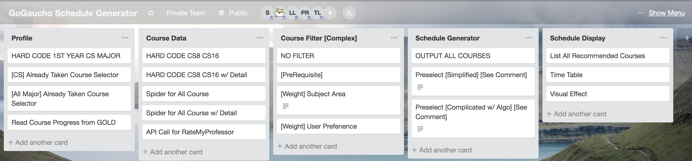

# ucsb-cs56-gogaucho
A web app that arrange your courses automatically.
Link: https://ucsb-cs56-gogaucho.herokuapp.com/

## How to run the code
1. [Go to Firebase](https://firebase.google.com/)
* click get started
* add a new project

2. Go to the DATABASE section and select Get Started button for Cloud Firestore

3. Select **Test Mode** for your Cloud Firestore Security Rule. At later stage you might want to switch it into **Locked Mode**. Then click enable.


4. Add Firebase Admin SDK in Maven:

In dependency ADD:

```
  <groupId>com.google.firebase</groupId>
  
  <artifactId>firebase-admin</artifactId>
  
  <version>6.4.0</version>

```

5. Set up the Private Key

* Go back to your firebase project home page
* In the left nav, click **Profect Settings** and then **Service accounts**
* Under the Firebase Admin SDK, find Generate Private Key (at the bottom)
* Generate and it will automatically downloaded
* Put the json file inside project repo.
* Inside GoGauchoMain.java, find the line (originally line 123)

``FileInputStream serviceAccount = new FileInputStream("src/main/java/edu/ucsb/cs56/GoGaucho/ucsb-cs56-GoGaucho-firebase-adminsdk-u3h8g-7d394cdd1c.json");``

and change the String in the FileInputStream to your json file path
* Add that json file into .gitignore

You do not want to upload the credentials.json file into github repo.
It contains private and sensitive information and you don't want other people to see it. 


## Story Map
**Trello Link:** https://trello.com/b/Xxvpwo2c/gogaucho-schedule-generator



## Run Schedule Algorithm
1.First in main create a vector of 3-elements tuple, each element are courses' starting time, ending time, and weight.
 Example:
 
 ```
 //Sample run with small set
	
int main(){
	vector<tuple<int, int, int>> v;
	v.push_back(make_tuple(1,5,10));
	v.push_back(make_tuple(2,5,1));
	v.push_back(make_tuple(3,5,2));
	v.push_back(make_tuple(6,9,5));
	v.push_back(make_tuple(4,6,19));
	SchedulePLan(v);
	
}
  ```


2.Then compile with version 11 or above g++
```
 g++ -std=c++11 schedule_plan.cpp -o schedule
```


3.Then run with ``` ./schedule ```
  It will output the optimal schedule and the max payoff
  Example run from main
  
 ``` 
  Max Payoff: 24
      4 6 19
      6 9 5
```
## Agreement
**Members**: Hengyu Liu, Pual Ren, Leo Lin, Alex Liu, Zhijun Yan, Tiancheng Lin

- Divide the work to each team members
- Contribute as much as possible

## M18 Final Remarks
- We successfully connect front end and back end to pass personal information to database and do "Searching". Next set of students can add "choose courses" feature and do post with our back end api and get final decided course list.
- We add login feature in both front end in nav.mustache and back end in main java, but some unknown issue happened so it doesn't work well. Next set of students can fix it and make it work.
- We do really "hard core" css beautification, so if next set of students are willing to do that, they can learn some related knowledge from "w3school" or other html tutoring web. 
- We only finish Freshmen CS Students' scheduling, but adding other major and grade should be easy because we have written the algorithm. Just add more course information to firebase and add corresponding select button in "personalinfo.mustache" to expand users.
